# EE599 Final Project - Spring 2021 - TrojanMap

## Deadline: 

Video Presentation: Wednesday, April 28 by 23:59 pm

Code submission: Friday, April 30 by 23:59 pm

## TrojanMap

This project focuses on using data structures in C++ and implementing various graph algorithms to build a map application.

<p align="center"></p>

- Please clone the repository, look through [README.md](README.md) and fill up functions to finish in the project.
- Please make sure that your code can run `bazel run/test`.
- In this project, you will need to fill up [trojanmap.cc](src/lib/trojanmap.cc) and add unit tests in the `tests` directory.

---

## The data Structure

Each point on the map is represented by the class **Node** shown below and defined in [trojanmap.h](src/lib/trojanmap.h).

```cpp
class Node {
  public:
    std::string id;    // A unique id assign to each point
    double lat;        // Latitude
    double lon;        // Longitude
    std::string name;  // Name of the location. E.g. "Bank of America".
    std::vector<std::string>
        neighbors;  // List of the ids of all neighbor points.
};

```

---

## Prerequisites

### OpenCV Installation

For visualization, we use OpenCV library. You will use this library as a black box and don't need to worry about the graphic details.

Use the following commands to install OpenCV.

```shell
$ cd 2021Spring_TrojanMap
$ git clone https://github.com/opencv/opencv.git
```

### Other library Installations

For Ubuntu:
```shell
$ sudo apt-get install cmake libgtk2.0-dev pkg-config
$ sudo apt install libcanberra-gtk-module libcanberra-gtk3-module
$ sudo apt-get install libncurses5-dev libncursesw5-dev
$ cp ubuntu/* ./
```

For MacOS:
```shell
$ brew install cmake
$ brew install ncurses
```

Next, type the following, but make sure that you set the **path_to_install_folder** to be the absolute path to the install folder under opencv.

```shell
$ cd opencv/
$ mkdir build install
$ cd build
$ cmake -D CMAKE_INSTALL_PREFIX=**path_to_install_folder**\
 -D BUILD_LIST=core,highgui,imgcodecs,imgproc,videoio\
 -D WITH_TBB=ON -D WITH_OPENMP=ON -D WITH_IPP=ON\
 -D CMAKE_BUILD_TYPE=RELEASE -D BUILD_EXAMPLES=OFF\
 -D WITH_NVCUVID=ON\
 -D WITH_CUDA=ON\
 -D BUILD_DOCS=OFF\
 -D BUILD_PERF_TESTS=OFF\
 -D BUILD_TESTS=OFF\
 -D WITH_CSTRIPES=ON\
 -D WITH_OPENCL=ON ..
$ make install
```

For example, if cloned this repo under "/Users/ari/github/TrojanMap", you should type:

```shell
$ cd opencv/
$ mkdir build install
$ cd build
$ cmake -D CMAKE_INSTALL_PREFIX=/Users/ari/github/TrojanMap/opencv/install\
 -D BUILD_LIST=core,highgui,imgcodecs,imgproc,videoio\
 -D WITH_TBB=ON -D WITH_OPENMP=ON -D WITH_IPP=ON\
 -D CMAKE_BUILD_TYPE=RELEASE -D BUILD_EXAMPLES=OFF\
 -D WITH_NVCUVID=ON\
 -D WITH_CUDA=ON\
 -D BUILD_DOCS=OFF\
 -D BUILD_PERF_TESTS=OFF\
 -D BUILD_TESTS=OFF\
 -D WITH_CSTRIPES=ON\
 -D WITH_OPENCL=ON ..
$ make install
```

---

## Run the program

Please run:

```shell
$ bazel run src/main:main
```

If everything is correct, this menu will show up.

```shell
Torjan Map
**************************************************************
* Select the function you want to execute.
* 1. Autocomplete
* 2. Find the position
* 3. CalculateShortestPath
* 4. Travelling salesman problem
* 5. Cycle Detection
* 6. Topological Sort
* 7. Exit
**************************************************************
Please select 1 - 7:
```

## Test the program

We created some tests for you to test your program, please run
```shell
$ bazel test tests:trojanmap_test
```

Please add you test in the [trojanmap_test_student.cc](tests/trojanmap_test_student.cc) and run

```shell
$ bazel test tests:trojanmap_test_student
```

## First task is to implement a function for each menu item

## Step 1: Autocomplete the location name

```c++
std::vector<std::string> Autocomplete(std::string name);
```

We consider the names of nodes as the locations. Implement a method to type the partial name of the location and return a list of possible locations with partial name as prefix. Please treat uppercase and lower case as the same character.

Example:

Input: "ch" \
Output: ["ChickfilA", "Chipotle Mexican Grill"]

Input: "ta" \
Output: ["Target", "Tap Two Blue"]

```shell
1
**************************************************************
* 1. Autocomplete                                             
**************************************************************

Please input a partial location:ch
*************************Results******************************
ChickfilA
Chipotle Mexican Grill
**************************************************************
Time taken by function: 1904 microseconds
```
### Function:
```c++
std::vector<std::string> Autocomplete(std::string name);
```
- Transfrom the input name to the lower case. Then traverse all nodes in the given data. Each time we transform the data.name to the lower case and find the transformed name that contains the given prefix name. We push back these names to the result, which is our final output.
- Time Complexity: O(n), where n is the number of nodes in the given map.

### Implementation
<p align="center">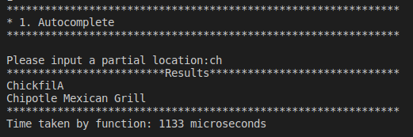</p>

## Step 2: Find the place's Coordinates in the Map

```c++
std::pair<double, double> GetPosition(std::string name);
```

Given a location name, return the latitude and longitude. There are no duplicated location names. You should mark the given locations on the map. If the location does not exist, return (-1, -1).

Example:

Input: "ChickfilA" \
Output: (34.0167334, -118.2825307)

Input: "Ralphs" \
Output: (34.0317653, -118.2908339)

Input: "Target" \
Output: (34.0257016, -118.2843512)

```shell
2
**************************************************************
* 2. Find the position                                        
**************************************************************

Please input a location:Target
*************************Results******************************
Latitude: 34.0257 Longitude: -118.284
**************************************************************
Time taken by function: 1215 microseconds
```

<p align="center"></p>

### Functions:
```c++
std::pair<double, double> GetPosition(std::string name);
```
- Traverse all nodes in the given data until we find the input name. If we find the name, record its latitude and longitude using GetLat() and GetLon(). Else we ouput (-1, -1).
- Time Complexity: O(n), where n is the number of nodes in the give map.
```c++
double GetLat(std::string id);
```
- Given location's id, return its latitude.
- Time Complexity: O(1).
```c++
double GetLon(std::string id);
```
- Given location's id, return its longitude.
- Time Complexity: O(1).

### Implementation
<p align="center"></p>
<p align="center"></p>

## Step 3: CalculateShortestPath between two places

```c++
std::vector<std::string> CalculateShortestPath_Dijkstra(std::string &location1_name,
                                               std::string &location2_name);
std::vector<std::string> CalculateShortestPath_Bellman_Ford(std::string &location1_name,
                                               std::string &location2_name);
```

Given 2 locations A and B, find the best route from A to B. The distance between 2 points is the euclidean distance using latitude and longitude. You should use both Dijkstra algorithm and Bellman-Ford algorithm. Compare the time for the different methods. Show the routes on the map. If there is no path, please return empty vector.

Please report and compare the time spent by these 2 algorithms.

Example:

Input: "Ralphs", "ChickfilA" \
Output: ["2578244375", "5559640911", "6787470571", "6808093910", "6808093913", "6808093919", "6816831441",
      "6813405269", "6816193784", "6389467806", "6816193783", "123178876", "2613117895", "122719259",
      "2613117861", "6817230316", "3642819026", "6817230310", "7811699597", "5565967545", "123318572",
      "6813405206", "6813379482", "544672028", "21306059", "6813379476", "6818390140", "63068610", 
      "6818390143", "7434941012", "4015423966", "5690152766", "6813379440", "6813379466", "21306060",
      "6813379469", "6813379427", "123005255", "6807200376", "6807200380", "6813379451", "6813379463",
      "123327639", "6813379460", "4141790922", "4015423963", "1286136447", "1286136422", "4015423962",
      "6813379494", "63068643", "6813379496", "123241977", "4015372479", "4015372477", "1732243576",
      "6813379548", "4015372476", "4015372474", "4015372468", "4015372463", "6819179749", "1732243544",
      "6813405275", "348121996", "348121864", "6813405280", "1472141024", "6813411590", "216155217", 
      "6813411589", "1837212103", "1837212101", "6820935911", "4547476733"]

```shell
3
**************************************************************
* 3. CalculateShortestPath
**************************************************************

Please input the start location:Ralphs
Please input the destination:ChickfilA
*************************Results******************************
The distance of the path is:1.53852 miles
**************************************************************
Time taken by function: 45149 microseconds
```

<p align="center"></p>

### Design
- Dijkstra
<p align="center">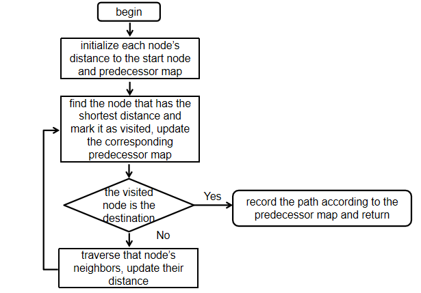</p>

- Bellman-Ford
<p align="center">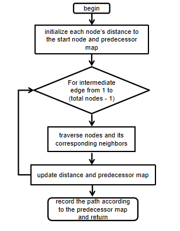</p>

### Functions:
```c++
std::vector<std::string> CalculateShortestPath_Dijkstra(std::string &location1_name,
                                               std::string &location2_name);
```
- Each time add the nearest unvisited location into the set IsVisited. Update shortest distance of this location’s neighbors and its predecessor map. End until the location is the destination. Traverse the predecessor map and output the shortest path. If we traverse neighbors that we can obtain and do not meet the destination, that means the start node cannot arrive at the destination. In this case, we return empty path.
- Time Complexity: O(n^2), where n is the number of nodes in the given map.
```c++
std::vector<std::string> CalculateShortestPath_Bellman_Ford(std::string &location1_name,
                                               std::string &location2_name);
```
- Each time update the shortest distance and predecessor map by adding the intermediate edge by one. End until we traverse all nodes. If the destination has been updated, we traverse the predecessor map and output the shortest path. Else, it means the start point cannot arrive at the destination, we return empty path.
- Time Complexity: O(n + m), where n is the number of nodes, m is the number of edges in the given map.
```c++
std::vector<std::string> GetNeighborIDs(std::string id);
```
- Given the location's name, return its neighbors.
- Time Complexity: O(1).
### Implementation
#### Dijkstra
<p align="center"></p>
<p align="center">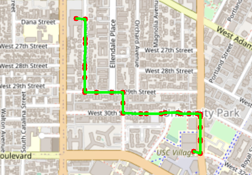</p>

#### Bellman-Ford
<p align="center">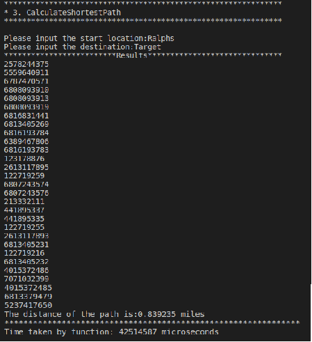</p>
<p align="center"></p>

As the pictures shown above, for the shortest path from Ralphs to Target, Dijkstra cost 0.44 seconds and Bellman-Ford cost 42.51 seconds.

## Step 4: The Travelling Trojan Problem (AKA Traveling Salesman!)

In this section, we assume that a complete graph is given to you. That means each node is a neighbor of all other nodes.
Given a vector of location ids, assume every location can reach all other locations in the vector (i.e. assume that the vector of location ids is a complete graph).
Find the shortest route that covers all the locations exactly once and goes back to the start point. 

You will need to return the progress to get the shortest route which will then be converted to an animation.  

We will use the following algorithms:

- Brute Force Method
```c++
std::pair<double, std::vector<std::vector<std::string>>> TravellingTrojan(
      std::vector<std::string> &location_ids);
```
- [2-opt Heuristic](https://en.wikipedia.org/wiki/2-opt). Also see [this paper](http://cs.indstate.edu/~zeeshan/aman.pdf)
```c++
std::pair<double, std::vector<std::vector<std::string>>> TravellingTrojan_2opt(
      std::vector<std::string> &location_ids);
```

Please report and compare the time spent by these 2 algorithms. 2-opt algorithm may not get the optimal solution. Please show how far your solution is from the optimal solution.

Show the routes on the map. For each intermediate solution, create a new plot. Your final video presentation should include the changes to your solution.

We will randomly select N points in the map and run your program.

```shell
4
**************************************************************
* 4. Travelling salesman problem                              
**************************************************************

In this task, we will select N random points on the map and you need to find the path to travel these points and back to the start point.

Please input the number of the places:10
Calculating ...
*************************Results******************************
The distance of the path is:4.70299 miles
**************************************************************
You could find your animation at src/lib/output.avi.          
Time taken by function: 152517394 microseconds
```

<p align="center"></p>

<p align="center"></p>

### Design
- Brute Force
<p align="center">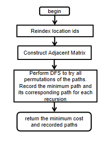</p>

- 2-OPT
<p align="center">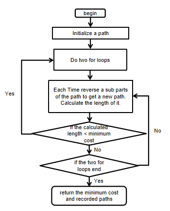</p>

- 3-OPT
<p align="center">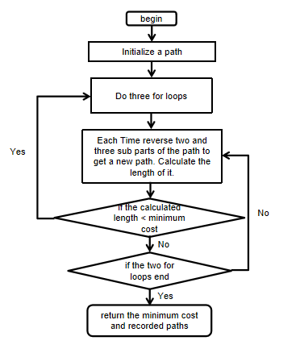</p>

- Genetic Algorithm
<p align="center"></p>

### Functions
```c++
std::pair<double, std::vector<std::vector<std::string>>> TravellingTrojan(
      std::vector<std::string> &location_ids);
```
- Create an adjacent matrix with row and columns to be locations reindexed id. Perform DFS to try all permutations of the path and find the minimum cost. For each time when we get a better path, we will push back this path to our final result. Return the minimum cost and the result vector.
- Time Complexity: O(n!), where n is the number of nodes in the input.
```c++
double TSP_helper(std::vector<std::vector<double>> &adjMatrix, std::vector<std::vector<int>> &results_idx,
      std::vector<int> &location_idx, int start, int curr, double &min_cost, 
      double curr_cost, std::vector<int> path);
```
- DFS algorithm. Find the minimum cost given the start.
- Time Complexity: O(n!), where n is the number of locations.
```c++
std::pair<double, std::vector<std::vector<std::string>>> TravellingTrojan_2opt(
                                    std::vector<std::string> &location_ids);
```
- Use two for loops to obtain a sub part in location ids vector and reverse this sub part. If the updated vector's path length is smaller, we update things like Brute Force one and back to start again. Repeat until no improvement is made.
- Time Complexity: O(n^2), where n is the number of locations.
```c++
std::vector<std::string> twoOptSwap(const std::vector<std::string> &curr_path, int i, int j);
```
- Reverse the given part to generate a new path.
- Time Complexity: O(n), where n is the number of locations.
```c++
std::pair<double, std::vector<std::vector<std::string>>> TravellingTrojan_3opt(
      std::vector<std::string> &location_ids);
```
- Use three for loops to obtain two or three sub parts in location ids vector and reverse these sub parts. If the updated vector's path length is smaller, we update things like Brute Force one and back to start again. Repeate until no improvement is made.
- Time Complexity： O(n^3), where n is the number of locations.
```c++
std::vector<std::string> threeOptSwap1(const std::vector<std::string> &curr_path, int i, int j, int k);
```
- Reverse three sub parts to generate a new path.
- Time Complexity: O(n), where n is the number of locations.
```c++
std::vector<std::string> threeOptSwap2(const std::vector<std::string> &curr_path, int i, int j, int k);
```
- Reverse two sub parts to generate a new path.
- Time Complexity: O(n), where n is the number of locations.
```c++
std::pair<double, std::vector<std::vector<std::string>>> TravellingTrojan_genetic;
```
- Create an adjacent matrix with row and columns to be locations reindexed id. Generate a random integer. Perform a for loop for the given random integer times. Each time generate a random path and adjust this path to get the local optimal path. For each loop when we get a better path, we will push back this path to our final result. Get the best path that has the minimum cost during the for loop.
- Time Complexity: O(n^3), where n is the number of locations.
```c++
int rand_num(int start, int end);
```
- Return a random integer from [start, end).

- Time Complexity: O(1).

```c++
std::vector<int> get_random_path(int n);
```
- Generate a random path.
- Time Complexity: O(n), where n is the number of locations.
```c++
double adjust_path(std::vector<int> &path, std::vector<std::vector<double>> &adjMatrix)；
```
- Find the best path under the circumstance of the given random path by swapping two nodes.
- Time Complexity: O(n^2), where n is the number of locations.
```c++
bool can_swap(std::vector<int> &path, int i, int j, std::vector<std::vector<double>> &adjMatrix);
```
- Compute whether the original path or the updated path has the lower cost. If it is the original path, return false, else, return true.
- Time Complexity: O(1).
```c++
double adjacent_cost(std::vector<int> &path, int i, int j, std::vector<std::vector<double>> &adjMatrix);
```
- Return Cost of AdjMatrix[path[i - 1]][j] + AdjMatrix[j][path[i + 1]].
- Time Complexity: O(1).
### Implementation
#### Brute Force
<p align="center">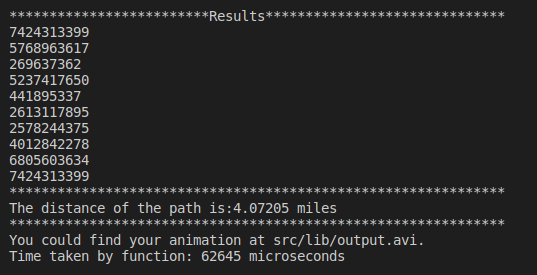</p>
<p align="center">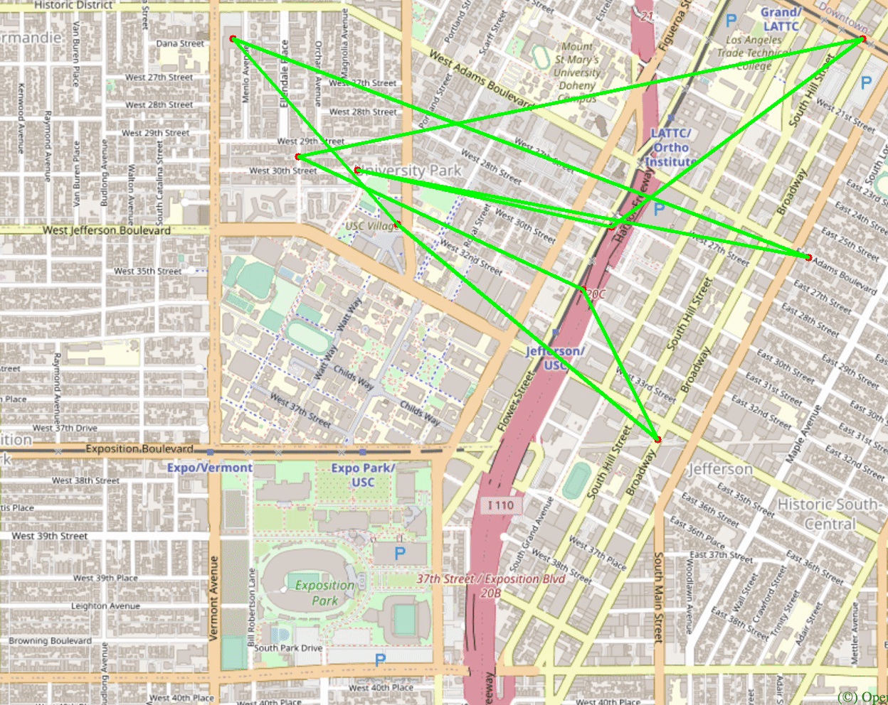</p>
#### 2-OPT
<p align="center">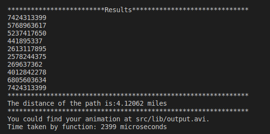</p>
<p align="center"></p>
#### 3-OPT
<p align="center">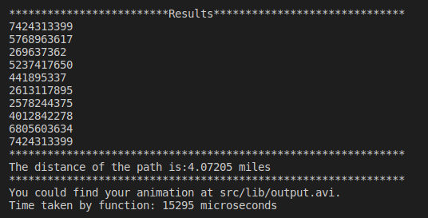</p>
<p align="center">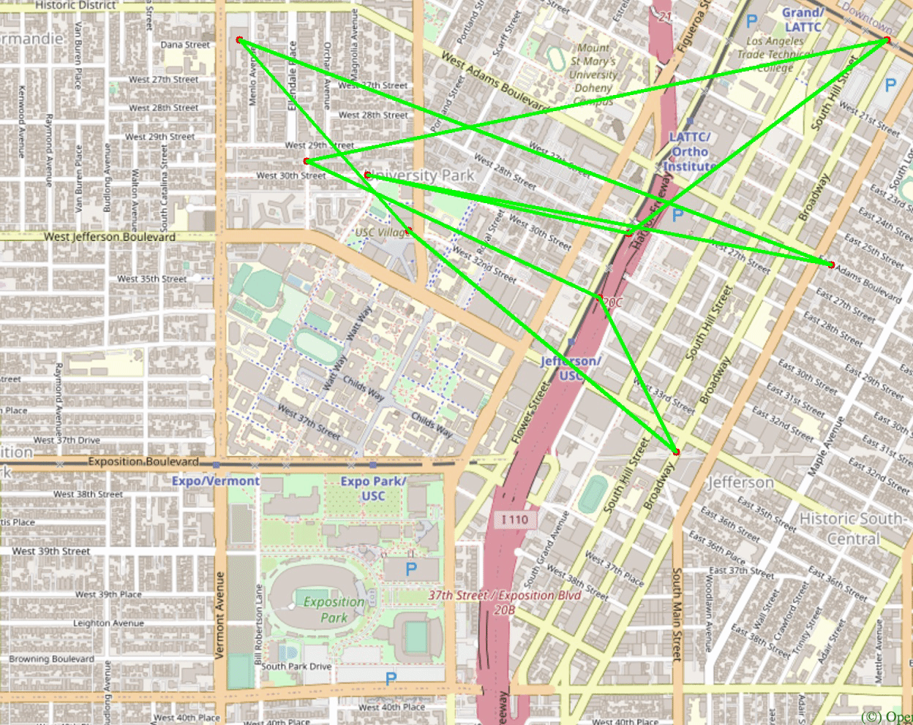</p>
#### Genetic Algorithm
<p align="center">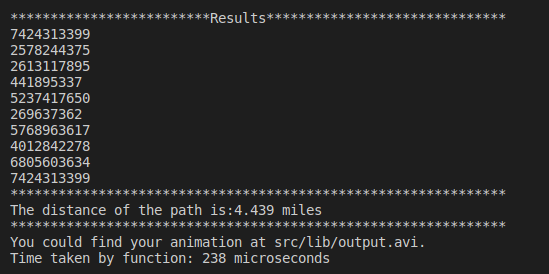</p>
<p align="center">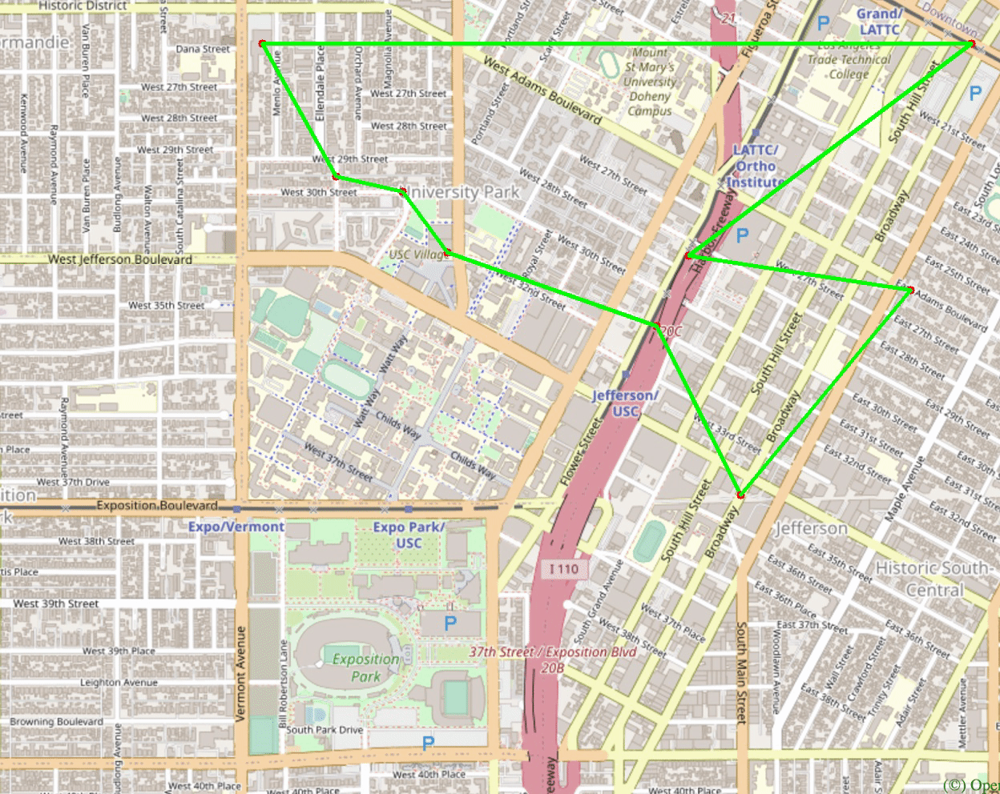</p>

## Step 5: Cycle Detection

```c++
bool CycleDetection(std::vector<double> &square);
```

In this section, we use a square-shaped subgraph of the original graph by using four coordinates stored in ```std::vector<double> square```, which follows the order of left, right, upper, and lower bounds. 

Then try to determine if there is a cycle path in the that subgraph. If it does, return true and report that path on the map. Otherwise return false.

Example 1:
```shell
Input: square = {-118.299, -118.264, 34.032, 34.011}
Output: true
```
Here we use the whole original graph as our subgraph. 
<p align="center"></p>

Example 2:
```shell
Input: square = {-118.290919, -118.282911, 34.02235, 34.019675}
Output: false
```
Here we use a square area inside USC campus as our subgraph
<p align="center">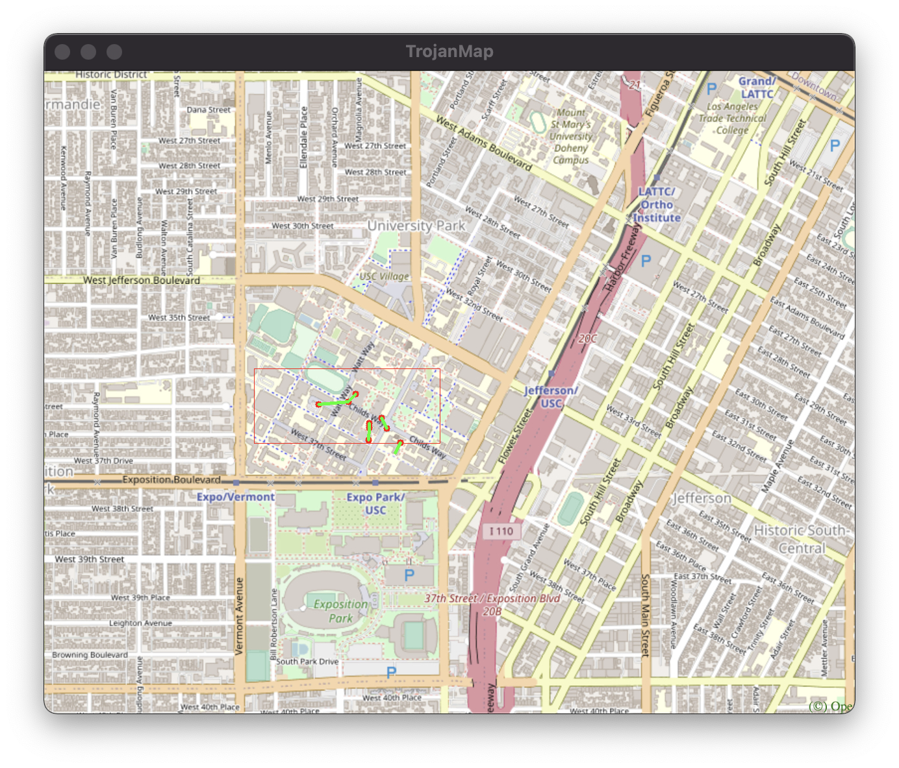</p>

Note: You could use the function below to visualize the subgraph. 

```c++
/**
 * PlotPoints: Given a vector of location ids draws the points on the map (no path).
 * 
 * @param  {std::vector<std::string>} location_ids : points inside square
 * @param  {std::vector<double>} square : boundary
 */
void TrojanMap::PlotPointsandEdges(std::vector<std::string> &location_ids, std::vector<double> &square)
```
```shell
5
**************************************************************
* 5. Cycle Detection                                          
**************************************************************

Please input the left bound longitude(between -118.299 and -118.264):-118.299
Please input the right bound longitude(between -118.299 and -118.264):-118.264
Please input the upper bound latitude(between 34.011 and 34.032):34.032
Please input the lower bound latitude(between 34.011 and 34.032):34.011
*************************Results******************************
there exists cycle in the subgraph 
**************************************************************
Time taken by function: 273734 microseconds

5
**************************************************************
* 5. Cycle Detection                                          
**************************************************************

Please input the left bound longitude(between -118.299 and -118.264):-118.290919
Please input the right bound longitude(between -118.299 and -118.264):-118.282911
Please input the upper bound latitude(between 34.011 and 34.032):34.02235
Please input the lower bound latitude(between 34.011 and 34.032):34.019675
*************************Results******************************
there exist no cycle in the subgraph 
**************************************************************
Time taken by function: 290371 microseconds
```

### Design
<p align="center">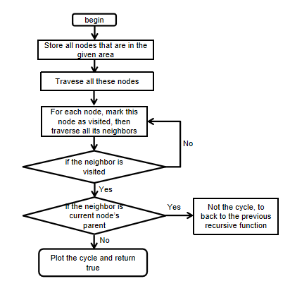</p>

### Functions
```c++
bool CycleDetection(std::vector<double> &square);
```
- Create a map visited that has all nodes in the given area and another map predecessor the child node and its parent node. Traverse all nodes in the visited map. If the node has not been visited, go to the hasCycle function. If has Cyclefunction return true, use predecessor map to plot cycle and return true.
- Time Complexity: O(n + m), where n is the number of nodes in the map and m is the number of edges in the given area.
```c++
bool TrojanMap::hasCycle(std::string &start, std::string current_id, std::map<std::string, bool>&visited, std::string parent_id, std::vector<double>&square, std::map<std::string, std::string> &map_predecessor);
```
- Mark current node as true in visited map. Traverse curent node's neighbor nodes and record current node as predecessor node of these neighbor nodes. If the neighbor is in area and it has not been visited, do recursive function. If the neighbor is in area and it has been visited and it is not the parent node, that means there exists a cycle. Then we return true. Else, we return false.
- Time Complexity: O(n + m), where n is the number of nodes in the given area, m is the number of edges in the given area.
### Implementation
<p align="center">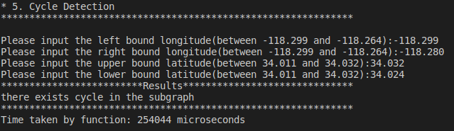</p>
<p align="center"></p>

## Step 6: Topological Sort

```c++
std::vector<std::string> DeliveringTrojan(std::vector<std::string> &location_names,
                                            std::vector<std::vector<std::string>> &dependencies);
```

Tommy Trojan got a part-time job from TrojanEats, for which he needs to pick up and deliver food from local restaurants to various location near the campus. Tommy needs to visit a few different location near the campus with certain order, since there are some constraints. For example, he must first get the food from the restaurant before arriving at the delivery point. 

The TrojanEats app will have some instructions about these constraints. So, Tommy asks you to help him figure out the feasible route!

Here we will give you a vector of location names that Tommy needs to visit, and also some dependencies between those locations.


For example, 

```shell
Input: 
location_names = {"Cardinal Gardens", "Coffee Bean1", "CVS"}
dependencies = {{"Cardinal Gardens","Coffee Bean1"}, {"Cardinal Gardens","CVS"}, {"Coffee Bean1","CVS"}}
```

Here, ```{"Cardinal Gardens","Coffee Bean1"}``` means
that Tommy must go to `Cardinal Gardens` prior to `Coffee Bean1`.

Your output should be:
```shell
Output: Cardinal Gardens -> Coffee Bean1 -> CVS
```
Also, we provide ```PlotPointsOrder``` function that can visualize the results on the map. It will plot each location name and also some arrowed lines to demonstrate a feasible route.

If no feasible route exists, you could simply return an empty vector.

Hint:
- You also need to finish ```ReadLocationsFromCSVFile``` and ```ReadDependenciesFromCSVFile``` functions, so you could read and parse data from you own CSV files. We also give two sample CSV files under ```input``` folder, which could be a reference. 
- When it asks you filenames, you need to give the absolute path.
- If you do not have ```ReadLocationsFromCSVFile``` and ```ReadDependenciesFromCSVFile``` functions ready yet, you can just press enter when it asks you filenames. It will call the default locations and dependencies.
- The locations are actually nodes, and the dependencies could be directed edges. You may want to first construct a DAG and then implement topological sort algorithm to get the route.

```shell
6
*************************Results******************************
Topological Sorting Results:
Cardinal Gardens
Coffee Bean1
CVS
**************************************************************
Time taken by function: 43 microseconds
```
<p align="center">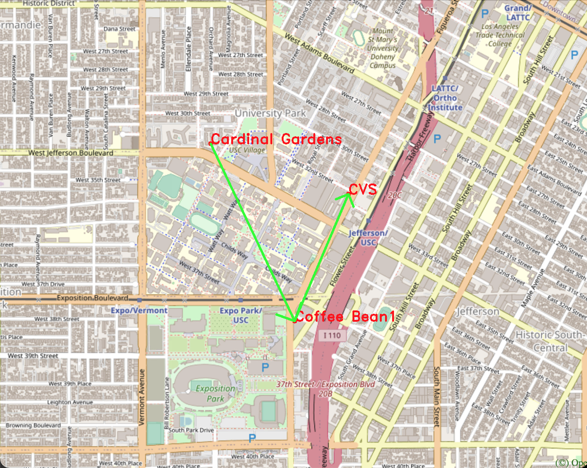</p>

In the user interface, we read the locations and dependencies from `topologicalsort_dependencies.csv` and `topologicalsort_locations.csv` to modify your input there.

### Design
<p align="center">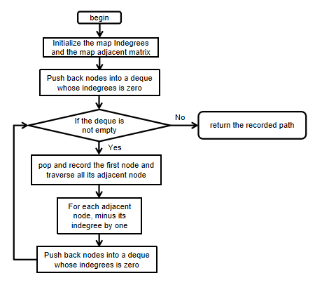</p>

### Function
```c++
std::vector<std::string> DeliveringTrojan(std::vector<std::string> &locations,
                                                     std::vector<std::vector<std::string>> &dependencies);
```
- Create a map Indegrees and a map adjacent matrix. Traverse all location and dependency to fill the adjacent matrix and indegrees. If the location has one dependency on another location, this location's indegree will plus one. Traverse all locations, if the location's indegree is 0, we push back this location into our deque. Then do BFS, pop the front location, push back that location into our vector result and traverse its dependencies. Minus the dependent location's indegrees by one. Each time when the location's indegrees become zero, we push back that location into our deque. Do this loop until the deque is empty. Finally, we will return the vector result, which is our topological sort path.
- Time Complexity: O(n + m), where n is the number of locations, m is the number of edges of the given graph.
### Implementation
<p align="center">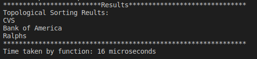</p>
<p align="center">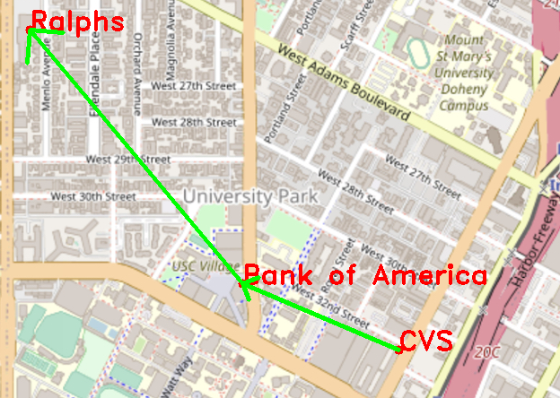</p>

## Lessions Learned
- It is important to use different data structure to improve the program efficiency.

- Obtain experience to write many recurisive algorithms and Dijkstra, Bellman-Ford and Genetic algorithm.

- Be patient and careful when designing algorithms and debugging codes.

## Reporting Runtime:
For each menu item, your program should show the time it took to finish each task.

## Report and Rubrics:

Your final project should be checked into Github. The README of your project is your report. 

### Report:

Your README file should include two sections:

1. High-level overview of your design (Use diagrams and pictures for your data structures).
2. Detailed description of each function and its time complexity.
3. Time spent for each function.
4. Discussion, conclusion, and lessons learned.

### Rubrics:

1. Implementation of auto complete: 10 points.
2. Implementation of GetPosition: 5 points.
3. Implementation of shortest path: 20 points.
   1. Bellman-Ford implementation
   2. Dijkstra implementation
   3. Plot two paths, and measure and report time spent by two algorithms.
4. Implementation of Travelling Trojan: 
   1. Brute Force: 10 points.
   2. 2-opt: 10 points.
   3. Animated plot: 5 points.
4. Implement of Cycle detection: 10 points.
   1. Boolean value and draw the cycle if there exists one.
5. Topological Sort: 10 points.
   1. Check whether there exist a topological sort or not
   2. Return the correct order and plot those point on the map
6. Creating reasonable unit tests: 10 points.
   1. Three different unit tests for each item.
7. Video presentation and report: 10 points.

8. **Extra credit items**: Maximum of 20 points:
   1. [3-opt](http://cs.indstate.edu/~zeeshan/aman.pdf): 10 points.
   2. [Genetic algorithm](https://www.geeksforgeeks.org/traveling-salesman-problem-using-genetic-algorithm/) implementation for Travelling Trojan: 10 points
   3. Create dynamic and animated UI using [ncurses](https://en.wikipedia.org/wiki/Ncurses): 10 points
      - You could check https://github.com/ourarash/ncurses_bazel
      - Please develope your own UI.
      - example
<p align="center"></p>
   Note: For Ubuntu, you main need to use the following command to prevent errors.
   
   ```shell
   $ bazel run --cxxopt='-std=c++17' src/main:main
   ```

