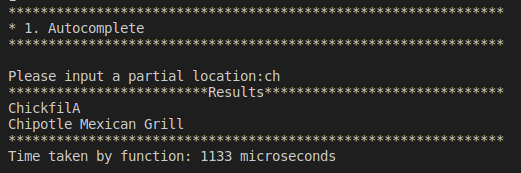
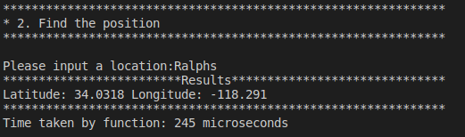
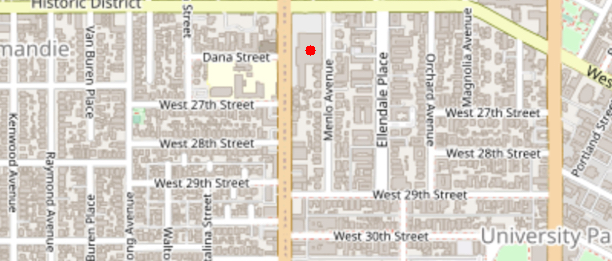
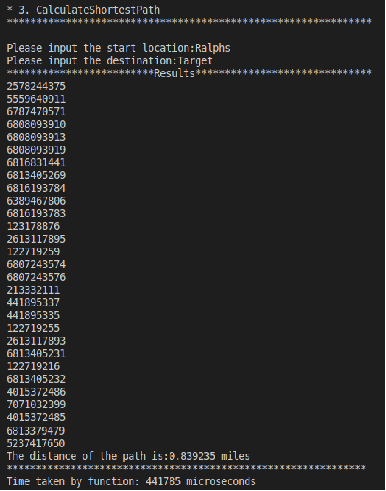
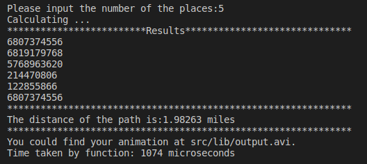
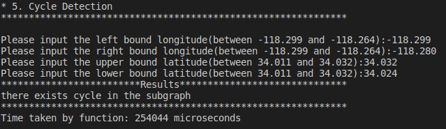
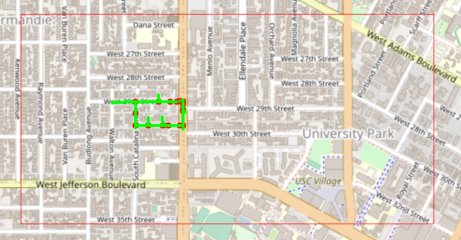

# EE599 TrojanMap Project
## Data Structure
```c++
class Node {
  public:
    Node(){};
    Node(const Node &n){id = n.id; lat = n.lat; lon = n.lon; name = n.name; neighbors = n.neighbors;};
    std::string id;    // A unique id assign to each point
    double lat;        // Latitude
    double lon;        // Longitude
    std::string name;  // Name of the location. E.g. "Bank of America".
    std::vector<std::string> neighbors;  // List of the ids of all neighbor points.
};

class TrojanMap {
 public:
   // A map of ids to Nodes.
  std::map<std::string, Node> data;
```
## Step 1: Autocomplete the location name
### Function:
```c++
std::vector<std::string> Autocomplete(std::string name);
```
- Transfrom the input name to the lower case. Then traverse all nodes in the given data. Each time we transform the data.name to the lower case and find the transformed name that contains the given prefix name. We push back these names to the result, which is our final output.
- Time Complexity: O(n), where n is the number of nodes in the given map.
### Implementation
<p align="center"></p>

## Step 2: Find the place's Coordinates in the Map
### Functions:
```c++
std::pair<double, double> GetPosition(std::string name);
```
- Traverse all nodes in the given data until we find the input name. If we find the name, record its latitude and longitude using GetLat() and GetLon(). Else we ouput (-1, -1).
- Time Complexity: O(n), where n is the number of nodes in the give map.
```c++
double GetLat(std::string id);
```
- Given location's id, return its latitude.
- Time Complexity: O(1).
```c++
double GetLon(std::string id);
```
- Given location's id, return its longitude.
- Time Complexity: O(1).
### Implementation
<p align="center"></p>
<p align="center"></p>

## Step 3: CalculateShortestPath between two places
### Design

### Functions:
```c++
std::vector<std::string> CalculateShortestPath_Dijkstra(std::string &location1_name,
                                               std::string &location2_name);
```
- Each time add the nearest unvisited location into the set IsVisited. Update shortest distance of this location’s neighbors and its predecessor map. End until the location is the destination. Traverse the predecessor map and output the shortest path. If we traverse neighbors that we can obtain and do not meet the destination, that means the start node cannot arrive at the destination. In this case, we return empty path.
- Time Complexity: O(n^2), where n is the number of nodes in the given map.
```c++
std::vector<std::string> CalculateShortestPath_Bellman_Ford(std::string &location1_name,
                                               std::string &location2_name);
```
- Each time update the shortest distance and predecessor map by adding the intermediate edge by one. End until we traverse all nodes. If the destination has been updated, we traverse the predecessor map and output the shortest path. Else, it means the start point cannot arrive at the destination, we return empty path.
- Time Complexity: O(n + m), where n is the number of nodes, m is the number of edges in the given map.
```c++
std::vector<std::string> GetNeighborIDs(std::string id);
```
- Given the location's name, return its neighbors.
- Time Complexity: O(1).
### Implementation
#### Dijkstra
<p align="center"></p>
<p align="center"></p>
#### Bellman-Ford
<p align="center"></p>
<p align="center"></p>

As the pictures shown above, for the shortest path from Ralphs to Target, Dijkstra cost 0.44 seconds and Bellman-Ford cost 42.51 seconds.
## Step 4: The Travelling Trojan Problem (AKA Traveling Salesman!)
### Functions
```c++
std::pair<double, std::vector<std::vector<std::string>>> TravellingTrojan(
      std::vector<std::string> &location_ids);
```
- Create an adjacent matrix with row and columns to be locations reindexed id. Perform DFS to try all permutations of the path and find the minimum cost. For each time when we get a better path, we will push back this path to our final result. Return the minimum cost and the result vector.
- Time Complexity: O(n!), where n is the number of nodes in the input.
```c++
double TSP_helper(std::vector<std::vector<double>> &adjMatrix, std::vector<std::vector<int>> &results_idx,
      std::vector<int> &location_idx, int start, int curr, double &min_cost, 
      double curr_cost, std::vector<int> path);
```
- DFS algorithm. Find the minimum cost given the start.
- Time Complexity: O(n!), where n is the number of locations.
```c++
std::pair<double, std::vector<std::vector<std::string>>> TravellingTrojan_2opt(
                                    std::vector<std::string> &location_ids);
```
- Use two for loops to obtain a sub part in location ids vector and reverse this sub part. If the updated vector's path length is smaller, we update things like Brute Force one and back to start again. Repeat until no improvement is made.
- Time Complexity: O(n^2), where n is the number of locations.
```c++
std::vector<std::string> twoOptSwap(const std::vector<std::string> &curr_path, int i, int j);
```
- Reverse the given part to generate a new path.
- Time Complexity: O(n), where n is the number of locations.
```c++
std::pair<double, std::vector<std::vector<std::string>>> TravellingTrojan_3opt(
      std::vector<std::string> &location_ids);
```
- Use three for loops to obtain two or three sub parts in location ids vector and reverse these sub parts. If the updated vector's path length is smaller, we update things like Brute Force one and back to start again. Repeate until no improvement is made.
- Time Complexity： O(n^3), where n is the number of locations.
```c++
std::vector<std::string> threeOptSwap1(const std::vector<std::string> &curr_path, int i, int j, int k);
```
- Reverse three sub parts to generate a new path.
- Time Complexity: O(n), where n is the number of locations.
```c++
std::vector<std::string> threeOptSwap2(const std::vector<std::string> &curr_path, int i, int j, int k);
```
- Reverse two sub parts to generate a new path.
- Time Complexity: O(n), where n is the number of locations.
```c++
std::pair<double, std::vector<std::vector<std::string>>> TravellingTrojan_genetic;
```
- Create an adjacent matrix with row and columns to be locations reindexed id. Generate a random integer. Perform a for loop for the given random integer times. Each time generate a random path and adjust this path to get the local optimal path. For each loop when we get a better path, we will push back this path to our final result. Get the best path that has the minimum cost during the for loop.
- Time Complexity: O(n^3), where n is the number of locations.
```c++
int rand_num(int start, int end);
```
- Return a random integer from [start, end).

- Time Complexity: O(1).

```c++
std::vector<int> get_random_path(int n);
```
- Generate a random path.
- Time Complexity: O(n), where n is the number of locations.
```c++
double adjust_path(std::vector<int> &path, std::vector<std::vector<double>> &adjMatrix)；
```
- Find the best path under the circumstance of the given random path by swapping two nodes.
- Time Complexity: O(n^2), where n is the number of locations.
```c++
bool can_swap(std::vector<int> &path, int i, int j, std::vector<std::vector<double>> &adjMatrix);
```
- Compute whether the original path or the updated path has the lower cost. If it is the original path, return false, else, return true.
- Time Complexity: O(1).
```c++
double adjacent_cost(std::vector<int> &path, int i, int j, std::vector<std::vector<double>> &adjMatrix);
```
- Return Cost of AdjMatrix[path[i - 1]][j] + AdjMatrix[j][path[i + 1]].
- Time Complexity: O(1).
### Implementation
#### Brute Force
<p align="center"></p>
<p align="center"></p>

#### 2-OPT

#### 3-OPT

#### Genetic Algorithm

## Step 5: Cycle Detection
### Functions
```c++
bool CycleDetection(std::vector<double> &square);
```
- Create a map visited that has all nodes in the given area and another map predecessor the child node and its parent node. Traverse all nodes in the visited map. If the node has not been visited, go to the hasCycle function. If has Cyclefunction return true, use predecessor map to plot cycle and return true.
- Time Complexity: O(n + m), where n is the number of nodes in the map and m is the number of edges in the given area.
```c++
bool TrojanMap::hasCycle(std::string &start, std::string current_id, std::map<std::string, bool>&visited, std::string parent_id, std::vector<double>&square, std::map<std::string, std::string> &map_predecessor);
```
- Mark current node as true in visited map. Traverse curent node's neighbor nodes and record current node as predecessor node of these neighbor nodes. If the neighbor is in area and it has not been visited, do recursive function. If the neighbor is in area and it has been visited and it is not the parent node, that means there exists a cycle. Then we return true. Else, we return false.
- Time Complexity: O(n + m), where n is the number of nodes in the given area, m is the number of edges in the given area.
### Implementation
<p align="center"></p>
<p align="center"></p>

## Step 6: Topological Sort
### Function
```c++
std::vector<std::string> DeliveringTrojan(std::vector<std::string> &locations,
                                                     std::vector<std::vector<std::string>> &dependencies);
```
- Create a map Indegrees and a map adjacent matrix. Traverse all location and dependency to fill the adjacent matrix and indegrees. If the location has one dependency on another location, this location's indegree will plus one. Traverse all locations, if the location's indegree is 0, we push back this location into our deque. Then do BFS, pop the front location, push back that location into our vector result and traverse its dependencies. Make the dependent location's indegrees minus one. Each time when the location's indegrees become zero, we push back that location into our deque. Do this loop until the deque is empty. Finally, we will return the vector result, which is our topological sort path.
- Time Complexity: O(n + m), where n is the number of locations, m is the number of edges of the given graph.
### Implementation
